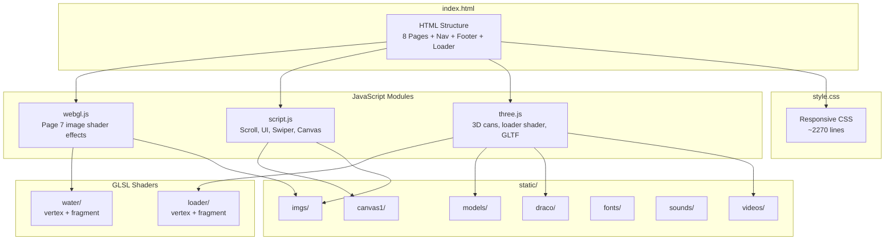
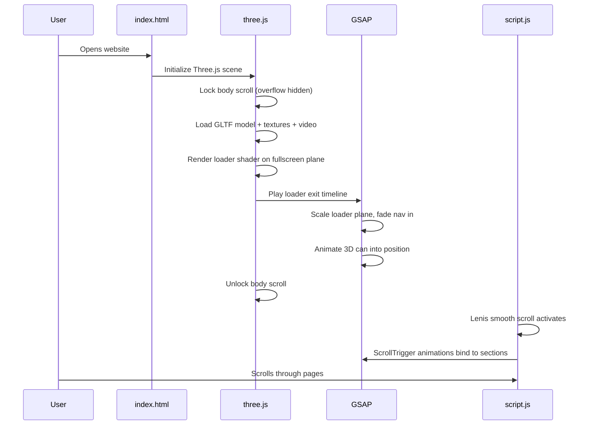
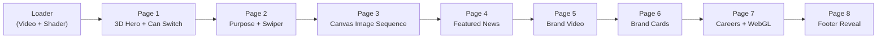
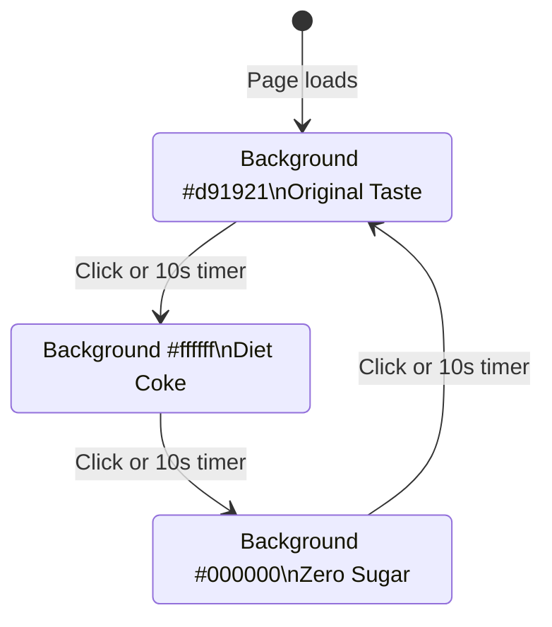
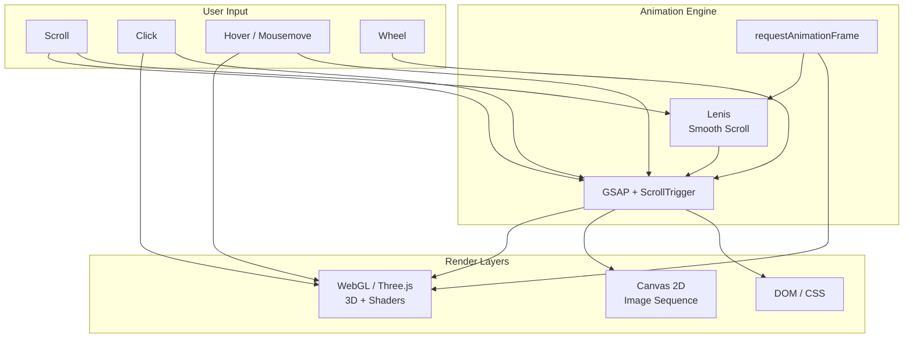
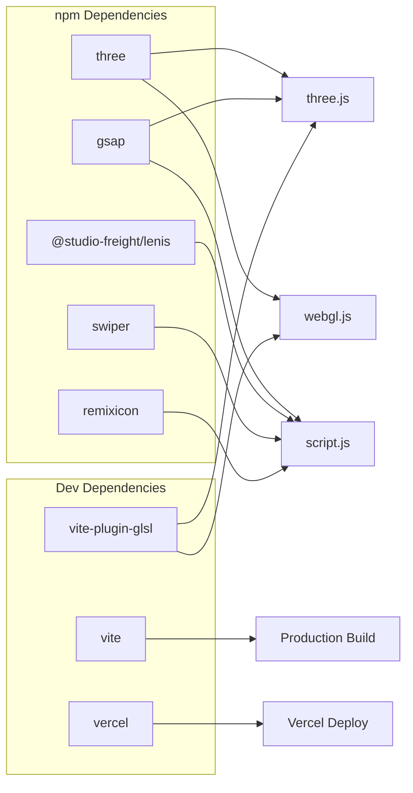
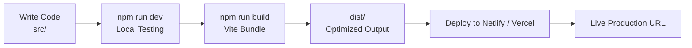

# The Coca-Cola Company — Interactive Landing Page

I designed and built this project from scratch as a full-stack front-end experience that reimagines The Coca-Cola Company's digital presence. I handled the HTML structure, CSS styling, JavaScript animations, Three.js 3D scenes, GLSL shaders, asset integration, build configuration, and deployment setup entirely on my own.

**Live Demo:** [https://the-coca-cola-companyy.netlify.app/](https://the-coca-cola-companyy.netlify.app/)

---

## Quick Start

Run these commands from the project root to get the repository up and running:

```bash
# Clone the repository
git clone https://github.com/RUDRA-PRATAP-SINGH01/Coca-Cola-Company.git

# Enter the project directory
cd Coca-Cola-Company

# Install dependencies
npm install

# Start the development server
npm run dev

# Build for production
npm run build

# Deploy to Vercel (production)
npm run deploy
```

| Command | Description |
|---------|-------------|
| `npm install` | Installs all project dependencies |
| `npm run dev` | Starts the Vite dev server with hot reload and opens the browser |
| `npm run build` | Creates an optimized production build in the `dist/` folder |
| `npm run deploy` | Deploys the project to Vercel in production mode |

---

## Project Overview

I created a single-page, scroll-driven marketing website for The Coca-Cola Company. The site combines GPU-accelerated 3D graphics, custom GLSL shaders, GSAP scroll animations, and smooth scrolling to deliver an immersive brand experience across desktop and mobile devices.

| Attribute | Detail |
|-----------|--------|
| Project Name | The Coca-Cola Company — Interactive Landing Page |
| Author | RUDRA PRATAP SINGH |
| Live Demo | [the-coca-cola-companyy.netlify.app](https://the-coca-cola-companyy.netlify.app/) |
| Repository | [github.com/RUDRA-PRATAP-SINGH01/Coca-Cola-Company](https://github.com/RUDRA-PRATAP-SINGH01/Coca-Cola-Company) |
| Build Tool | Vite 5 |
| Deployment | Netlify (live) / Vercel (CLI) |
| Architecture | Single-page application (SPA) |
| Primary Language | JavaScript (ES Modules) |

---

## Tech Stack

### Core Technologies

| Technology | Version | Role in This Project |
|------------|---------|-------------------|
| HTML5 | — | Semantic page structure, sections, navigation, and media elements |
| CSS3 | — | Responsive layout, typography, custom cursors, and page-specific styling |
| JavaScript (ESM) | — | Animation logic, scroll interactions, and module orchestration |
| Vite | ^5.2.9 | Development server, bundling, and production builds |
| Three.js | ^0.163.0 | 3D Coca-Cola can models, WebGL rendering, and scene management |
| WebGL | — | GPU-based rendering for 3D scenes and shader effects |
| GLSL | — | Custom vertex and fragment shaders for loader and image distortion effects |

### Animation and Interaction Libraries

| Library | Version | Role in This Project |
|---------|---------|-------------------|
| GSAP | ^3.12.5 | Timeline animations, ScrollTrigger pinning, and scroll-scrubbed effects |
| Lenis | ^1.0.42 | Smooth scroll behavior integrated with GSAP ScrollTrigger |
| Swiper | ^11.1.1 | Touch-enabled carousel on the Purpose page |
| Remix Icon | ^4.2.0 | Navigation, footer, and UI iconography |

### Build and Deployment Tools

| Tool | Version | Role in This Project |
|------|---------|-------------------|
| vite-plugin-glsl | ^1.3.0 | Imports `.glsl` shader files as JavaScript modules |
| Vercel CLI | ^34.2.0 | Production deployment pipeline |

### 3D Asset Pipeline

| Component | Detail |
|-----------|--------|
| GLTF/GLB | `static/models/3_cans_com.glb` — three Coca-Cola can variants |
| DRACO Compression | `static/draco/` — compressed mesh decoding for faster 3D model loading |
| Image Sequence | `static/canvas1/` — 39 PNG frames for scroll-driven canvas animation |
| Video Assets | `static/videos/` — loader and brand showcase videos |
| Audio | `static/sounds/canSwitch3.wav` — can switch interaction sound |

---

## High-Level Architecture

I structured the application as three independent JavaScript modules that load from a single HTML entry point, each responsible for a distinct layer of the experience.



---

## Application Workflow

### Page Load Sequence

I designed the loader to block scrolling until all 3D assets are ready, then transition into the main experience.



### User Scroll Flow



### 3D Can Interaction Cycle

I implemented a click and auto-timer cycle that rotates through three can variants with synchronized text, color, and sound changes.



---

## Page Breakdown

I built eight distinct sections, each with its own animation system and visual identity.

| Page | Section ID | What I Built | Key Technologies |
|------|-----------|--------------|-----------------|
| Loader | `.main-loader` | Fullscreen video with GLSL displacement shader transition | Three.js, GLSL, GSAP |
| Hero | `#page1` | Interactive 3D Coca-Cola cans with click-to-switch and scroll parallax | Three.js, GLTF, DRACO, GSAP |
| Purpose | `#page2` | Marquee text, pinned Swiper carousel, custom cursor | GSAP, ScrollTrigger, Swiper |
| Canvas | `#page3` | 39-frame scroll-driven image sequence with text reveal | Canvas 2D API, GSAP ScrollTrigger |
| News (Desktop) | `#page4Desktop` | Hover-following image preview with section-based image swap | GSAP |
| News (Mobile) | `#page4Mobile` | Card-based news layout for smaller screens | CSS Media Queries |
| Video | `#page5` | Expanding brand video on scroll with click-to-pause | GSAP ScrollTrigger |
| Brands | `#page6` | Pinned scroll with five brand cards and hover text overlays | GSAP, ScrollTrigger |
| Careers | `#page7` | Job section with WebGL chromatic aberration image effects | Three.js, GLSL, GSAP |
| Footer | `#footer-fixed` | Fixed footer with animated SVG line effects and social links | GSAP, CSS |

---

## Source File Structure

| File | Lines (approx.) | Responsibility |
|------|----------------|----------------|
| `src/index.html` | ~507 | HTML structure for all pages, navigation, footer, and script imports |
| `src/style.css` | ~2270 | Global styles, responsive breakpoints, page layouts, custom cursors |
| `src/script.js` | ~1037 | Lenis scroll, magnetic cursor, text effects, nav menu, page 2–7 animations, Swiper, canvas sequence, footer |
| `src/three.js` | ~821 | Three.js scene, GLTF loading, loader shader, can switch logic, scroll parallax, lighting |
| `src/webgl.js` | ~186 | Desktop-only WebGL water/distortion shader on career page images |
| `src/shaders/loader/vertex.glsl` | — | Fullscreen loader plane vertex shader |
| `src/shaders/loader/fragment.glsl` | — | Video texture displacement effect |
| `src/shaders/water/vertex.glsl` | — | Page 7 image plane vertex shader |
| `src/shaders/water/fragment.glsl` | — | Mouse-driven pixel distortion and chromatic aberration |

---

## Static Assets Structure

| Directory | Contents | Used By |
|-----------|----------|---------|
| `static/imgs/` | Logos, slider images, feature images, brand images, job photos, favicon | HTML, CSS, JS |
| `static/videos/` | Loader video, page 5 brand video | HTML, Three.js |
| `static/models/` | `3_cans_com.glb` — three can 3D model | Three.js |
| `static/canvas1/` | 39 PNG frames (`canvas (1).png` to `canvas (39).png`) | script.js canvas animation |
| `static/fonts/` | Coca-Cola custom font, heading font, paragraph fonts | CSS @font-face |
| `static/sounds/` | `canSwitch3.wav` — can switch sound effect | three.js |
| `static/draco/` | DRACO decoder/encoder for compressed GLTF meshes | Three.js DRACOLoader |

---

## Build Configuration

I configured Vite with a non-standard root directory so that `src/` serves as the application root while `static/` acts as the public asset directory.

| Setting | Value | Purpose |
|---------|-------|---------|
| `root` | `src/` | HTML entry point lives inside `src/` |
| `publicDir` | `../static/` | Static assets served from `/imgs/`, `/videos/`, etc. |
| `base` | `./` | Relative paths for flexible deployment |
| `outDir` | `../dist/` | Production build output |
| `sourcemap` | `true` | Debug support in production |
| `plugins` | `vite-plugin-glsl` | Enables `.glsl` file imports in JavaScript |

---

## Feature Summary

| Feature | Implementation | File(s) |
|---------|---------------|---------|
| Smooth scrolling | Lenis integrated with GSAP ticker and ScrollTrigger | `script.js` |
| Custom magnetic cursor | GSAP mouse tracking with scale on hover targets | `script.js`, `style.css` |
| Text scramble effect | Letter-by-letter span wrapping with GSAP stagger | `script.js` |
| Navigation slide-in menu | GSAP timeline with pause/reverse on open/close | `script.js` |
| Auto-hiding navbar | Scroll direction detection with color theme switch | `script.js` |
| 3D can model with DRACO | GLTFLoader + DRACOLoader with compressed mesh | `three.js` |
| Loader shader transition | Custom GLSL displacement on video texture | `three.js`, `shaders/loader/` |
| Can auto-cycle timer | 10-second GSAP timeline with sound and text sync | `three.js` |
| Scroll image sequence | 39-frame canvas draw synced to scroll position | `script.js` |
| Swiper carousel | Looping 3-slide carousel with navigation buttons | `script.js` |
| WebGL image distortion | Mouse-driven chromatic aberration shader (desktop only) | `webgl.js`, `shaders/water/` |
| Responsive design | CSS media queries at 1200px, 992px, 768px breakpoints | `style.css` |
| Footer SVG line animation | GSAP path morphing on mousemove | `script.js` |

---

## Responsive Breakpoints

I defined responsive behavior across four viewport ranges to ensure the site works on all screen sizes.

| Breakpoint | Target Devices | Key Changes |
|------------|---------------|-------------|
| Default (> 1200px) | Desktop | Full layout, custom cursors, WebGL effects, 4-column news |
| 769px – 1200px | Tablet landscape | Adjusted font sizes, simplified text layouts |
| 481px – 768px | Tablet portrait | Hidden desktop cursors, adjusted spacing |
| < 768px | Mobile | Mobile news cards, single-column layouts, WebGL disabled, hidden custom cursors |

---

## Data Flow Diagram



---

## Module Dependency Graph



---

## Deployment Workflow



| Stage | Command | Output |
|-------|---------|--------|
| Development | `npm run dev` | Local server at `http://localhost:5173` |
| Build | `npm run build` | Bundled files in `dist/` with sourcemaps |
| Deploy | `npm run deploy` | Production deployment via Vercel CLI |
| Live Site | — | [the-coca-cola-companyy.netlify.app](https://the-coca-cola-companyy.netlify.app/) |

---

## Browser Compatibility

| Browser | Supported | Notes |
|---------|-----------|-------|
| Google Chrome | Yes | Full feature support including WebGL shaders |
| Mozilla Firefox | Yes | Full feature support |
| Microsoft Edge | Yes | Full feature support |
| Apple Safari | Yes | WebGL effects supported; smooth scroll via Lenis |
| Mobile browsers | Partial | WebGL image effects disabled; layout adapts via CSS |

---

## Project Statistics

| Metric | Value |
|--------|-------|
| Source files | 9 |
| Total CSS lines | ~2,270 |
| Total JS lines | ~2,044 |
| GLSL shader files | 4 |
| HTML pages/sections | 8 |
| Canvas animation frames | 39 |
| 3D model variants | 3 (Red, Grey, Black) |
| Responsive breakpoints | 4 |
| npm dependencies | 5 runtime + 3 dev |
| Production bundle size | ~857 KB (JS) + ~154 KB (CSS) |

---

## Why I Chose Coca-Cola

I selected The Coca-Cola Company as the subject for this project because of its global brand recognition and the creative opportunity to modernize its digital footprint. I wanted to demonstrate that a front-end developer can deliver a premium, interactive brand experience using modern web technologies without relying on a back-end framework.

---

## Credits and Acknowledgments

| Resource | Source |
|----------|--------|
| Images | [Unsplash](https://unsplash.com/) |
| Videos | [YouTube](https://www.youtube.com/) |
| Loader Video | [Chow's Show](https://www.youtube.com/watch?v=s3p5jIgIGSg) |
| Brand Video | [Arthur Whitehead](https://www.youtube.com/@ArthurWhitehead) |
| 3D Coca-Cola Model | Custom Blender model commissioned for this project |
| GSAP | [gsap.com](https://gsap.com/) |
| Three.js | [threejs.org](https://threejs.org/) |
| Lenis | [lenis.darkroom.engineering](https://lenis.darkroom.engineering/) |
| Swiper | [swiperjs.com](https://swiperjs.com/) |
| Vite | [vitejs.dev](https://vitejs.dev/) |
| vite-plugin-glsl | [github.com/UstymUkhman/vite-plugin-glsl](https://github.com/UstymUkhman/vite-plugin-glsl) |
| Vercel | [vercel.com](https://vercel.com/) |
| Remix Icon | [remixicon.com](https://remixicon.com/) |

---

## License

ISC

---

## Author

**RUDRA PRATAP SINGH**

- Live Demo: [the-coca-cola-companyy.netlify.app](https://the-coca-cola-companyy.netlify.app/)
- GitHub: [RUDRA-PRATAP-SINGH01](https://github.com/RUDRA-PRATAP-SINGH01)
- Repository: [Coca-Cola-Company](https://github.com/RUDRA-PRATAP-SINGH01/Coca-Cola-Company)

I designed, developed, and deployed this entire project independently.
